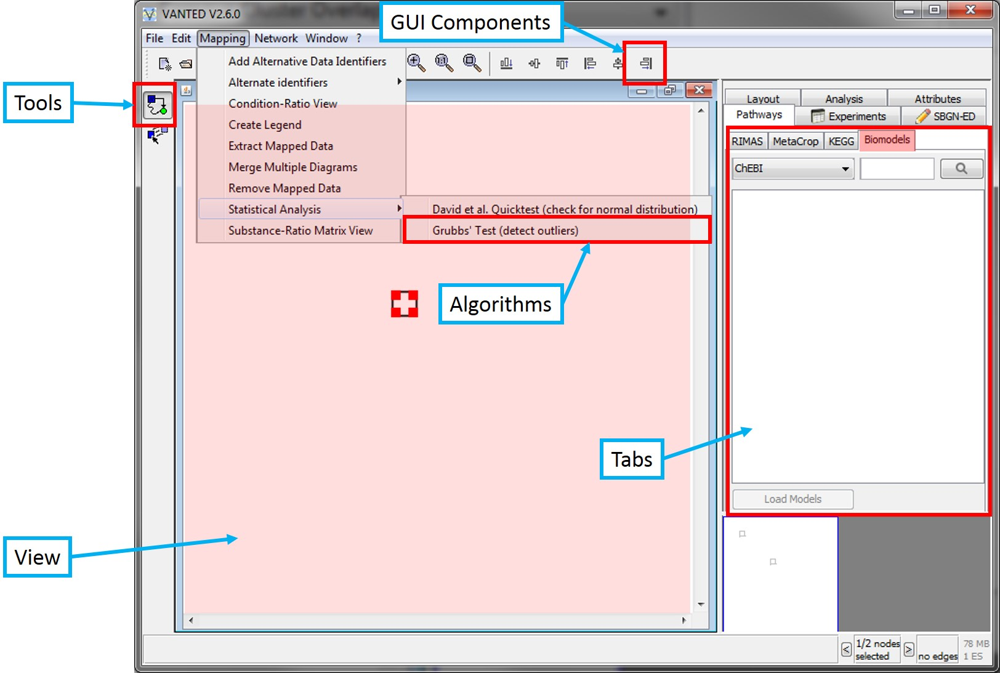

# Extend VANTED
## Add new Algorithms, Views, and Visual Graph Components

To extend the functionality of VANTED you can create Add-On's that provide new 

* algorithms (Graphical, Computational, etc)
* views (graphical display of graph or other information)
* Buttons
* Menu-items
* Side-Tabs
* custom visual components for graph drawing (Attribute Components)
* tools
* file formats

The following image highlights areas, that support custom extension provided by the addon.



All those extensions extend certain interfaces / classes to garuantee support of certain methods.

To extend the functionality, you add the extension to provided array fields, that are present in the main entry class of the Add-on. (see [Project Structure](ProjectStructure.md) for details.
This entry class must extend `de.ipk_gatersleben.ag_nw.graffiti.plugins.addons.AddonAdapter` to have the necessary fields.

If you take the example addon class, it will look like this. This addon makes use of every possible extension possibility in VANTED.

```java
public class MyAddon extends AddonAdapter {
	
	/**
	 * This class will automatically start all implemented Algorithms, views and
	 * other extensions written in your Add-on. 
	 */
	@Override
	protected void initializeAddon() {
		// registers user interface tabs in the sidepanel, on which you may add
		// any Jcomponent you want to
		this.tabs = new InspectorTab[] { 
			new MyTab() 
		};
		
		// registers a number of algorithms which can manipulate graphs (and
		// views, if they are editoralgorithms)
		this.algorithms = new Algorithm[] {
			new MyAlgorithm()
		};
		
		// registers a number of views, which can be created from code or via
		// File->New View (you can also decide not to register, but just to create
		// such views from code.
		this.views = new String[] { 
			MyFirstView.class.toString() 
		};
		
		// registers a new Button in the Toolbar
		this.guiComponents = new GraffitiComponent[] {
				new ToolbarButton("defaultToolbar", WindowOrder.HORIZONTAL),
				new ToolbarButton("defaultToolbar", WindowOrder.VERTICAL),
				new ToolbarButton("defaultToolbar", WindowOrder.QUADRATIC) };
		
		// registers a new Attribute
		this.attributes = new Class[1];
		this.attributes[0] = StarAttribute.class;
		
		// registers this attribute as a special string attribute
		StringAttribute.putAttributeType(StarAttribute.name, StarAttribute.class);
		
		// registers, that the attribute with a certain name is instance of a
		// class and how it will be displayed in the AttributeEditor
		// note that "Stars: Stars" will lead to clustering all attributes
		// starting with
		// "Stars:" together. The attributename "starsize" may also be given with
		// the complete
		// name, e.g. ".graphics.stars"
		this.attributeDescriptions = new AttributeDescription[] {
				new AttributeDescription(StarAttribute.name,
						StarAttribute.class, "Stars: Stars", true, false, null), };
		
		// as an alternative to using attributedescriptions, one may also specify
		// a nice attribute description with this command:
		// AttributeHelper.setNiceId("starsize", "Stars: Size");
		
		// registers an editor for the star-Attribute
		valueEditComponents.put(StarAttribute.class, StarAttributeEditor.class);
		
		// registers a component for the attribute, to visualise the star
		attributeComponents.put(StarAttribute.class, StarAttributeComponent.class);
		
		// registers deleteable attributes, just hover over the name and click
		AttributeHelper.setDeleteableAttribute("." + StarAttribute.path + ".", StarAttribute.path);
		
		// this attribute will not serialized (saved in the gml file)
		// AttributeManager.getInstance().addUnwrittenAttribute("." + StarAttribute.path + "." + StarAttribute.name);
		
		// registers a serializer to write a graph-file to any format
		// inputserializers should extend AbstractInputSerializer
		outputSerializers = new OutputSerializer[] {
				new TestWriter()
		};
		
	}
	...
}
```

The following chapters will give an introduction on each addon extension.

#### Add new tabs to appear in the list of tabs

This example shows, how a new 'MyTab'-tab is added to the list of new tabs.

```
		this.tabs = new InspectorTab[] { 
			new MyTab() 
		};
```		

For how to implement a new Tab read [this](DevelopTabs.md).

#### Add new Algorithms

You can simply add a number of new algorithms by adding new algorithm objects to the `this.algorithms` array

```
		this.algorithms = new Algorithm[] {
			new MyAlgorithm()
		};
```

For how to implement a new algorithm read [here](DevelopAlgorithm.md)

