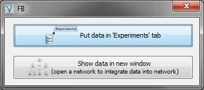

# Extending the Experiment loading capabilities

This document will show you how to extend certain parts of the experiment handling code.

It includes examples for new document type readers as well as action buttons, that perform actions after the experiment has been loaded.

## Implementing a new experiment document reader

If you develop a new document reader you can directly extend the `ExperimentDataDragAndDropHandler` class and implement the only method in there

```java
class MyExperimentDataDragAndDropHandler

	ExperimentDataPresenter receiver;
	
	public void setExperimentDataReceiver(ExperimentDataPresenter receiver) {
		this.receiver = receiver;
	}

	/*
	 * is called, after 'canProcess' has been called a returned
	 * true, meaning this handler can deal with this file type
	 */
	public boolean process(List<File> files) {
		// your parsing code for the file to create a new
		// experiment
		// if more should happen you have to call the receiver
		
		receiver.processReceivedData(TableData td, String experimentName, ExperimentInterface doc, JComponent gui);
	}
	
	/**
	 * @param f
	 *           Input file to be analyzed for compatibility.
	 * @return True, if this handler might handle the input file. E.g. based on
	 *         the file extension.
	 */
	public boolean canProcess(File f){
		...
	}
	
	/**
	 * @return True, if the handler should be called before other handlers
	 *         are executed, which return False.
	 */
	public boolean hasPriority() {
		return false;
	}
}
```

You then have to register this drag'n drop handler to Vanted by calling. This is usually done in your Addon startup code. (see [Add-on development](AddonDevelopment.md))

```Java
	GravistoMainHelper.addDragAndDropHandler(new MyExperimentDataDragAndDropHandler());
```

## Implementing a new Action Button for read experiment data

Usually after an experiment file has been read and you didn't override or ignore the receiver object, a dialog box is shown to ask the user, what he wants to do with the loaded data.



You can add your own action button to this list. They are also extending the `Algorithm` interface and get executed, if clicked on it.

```Java
class MyAbstractExperimentDataProcessor {
	
	private ExperimentInterface md;
	...
	
	/*
	 * This is called by Vanted to set the experiment data
	 */
	@Override
	public void setExperimentData(ExperimentInterface md) {
		this.md = md;
	}
	/*
	 * This method is called after 'setExperimentData'.
	 * Here you can do whatever you want with the experiment data
	 */
	@Override
	public void processData() {
		...
	}

}
```

Finally, you have to register this processor with VANTED by calling. This is usually done in your Addon startup code. (see [Add-on development](AddonDevelopment.md))

```Java 			
ExperimentDataProcessingManager.addExperimentDataProcessor(new PutIntoSidePanel());
```
