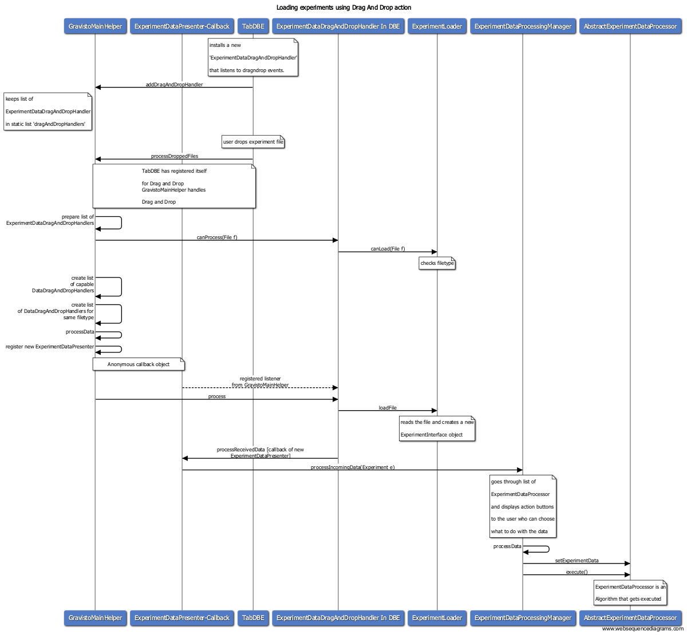

# How experiments are loaded

This documents shows a sequence diagram of how an experiment file is loaded, if a user performes a drag'n drop action.

To extend the functionality (new document types etc.) read the [[Extending the Experiment loading capabilities|ExtendingExpLoading]] document.