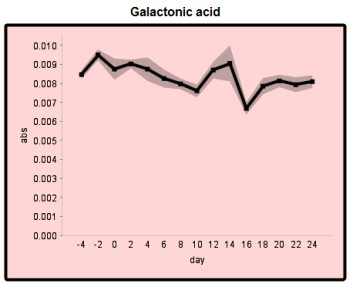
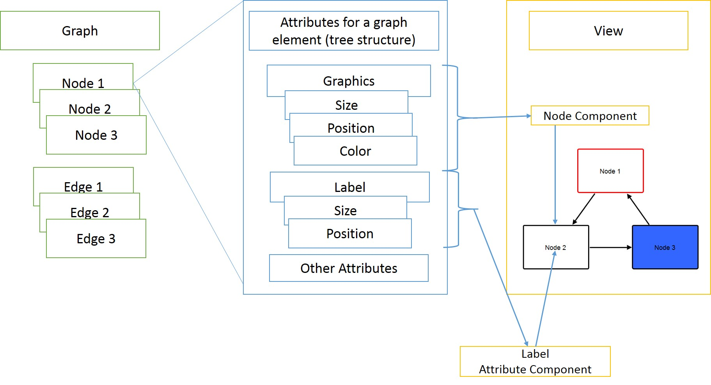

# An introduction into VANTED Graph Drawing

This introduction will focus on the technical aspects of how VANTED is actually drawing graphs, taking some kind of graph structure.

## The design principle

VANTED follows the design principles of *MVC* (Model-View-Controller) and thus does a separation of the graph structure and its graphical display.

## The Model

### The Graph

The graph model consists basically of 3 classes (Java Interfaces).

* Graph
* Node
* Edge

The **graph** holds a list of nodes and edges in a list, matrix or any other data structure depending on the implementation.

A **node** keeps a list of edges, that connect it to its neighbours.

An **edge** just contains its source and target node.

Implementing classes usually provide more methods for convenience to access certain fields and data.

The graph model only stores the basic information about a graph. These do **NOT** include information such as position, size, color, etc.

### Attributes

To store data connected to the graph and its entities, all of the above elements also extend the `Attributable` interface, which means they have methods to add/change/remove attributes for specific entities. Attributes can be hierarchical, consisting of a path ('.'-separated String) and an attribute name. For the actual implementation a manual tree-like data structure has been implemented. 

Attributes can be of different types, including String, Boolean, Integer, Long, Double, or plain Objects.

Attributes can consist of graphical attributes for size, position, color, shape attributes, etc., as well as arbitrary attributes to store custom information such as experimental data, graph analysis results, cluster information and so on.

## The View

To display the graph, the implementation uses the standard Java Swing framework. Each graphical element that is drawn (nodes, edges and attributes) are `JComponents` that are added to a Container with absolute positions.

Note: This design decision was made with the beginnings of VANTED and will soon be subject to change.

### The Graph

The graphs visual representation is just a simple `JComponent` usually embedded in a `JScrollpane`.

Each graph element (node or edge) is called a *Graph Element Component* and extends the abstract class `GraphElementComponent`, which in turn extends `JComponent`. These graph elements salvage the graphical attributes stored in the model to create and update the shape, color, position and so on.

The following image shows two nodes and one edge as well as the edges of the `JComponent` they are embedded in. This is only for debugging. Usually the frames are not visible.

### Attributes

Also attributes can have a graphical representation as well, called *Graph Attribute Components*. Examples would be labels, images or charts. During startup, a scan process adds entries from pre-defined maps between attributes and attribute components. These relationships have to be created by the implementor. 

VANTED comes with a list of pre-implemented components, that are stored in a map returning the matching component to an attribute. Of course, this map can be extended by adding custom components through extensions (see [Add-on development](AddonDevelopment.md)).

These attribute components are dependent components, since they usually do not exist without a node or edge component. Attribute components are positioned relative to their 'parent' component. Here, parent is not the parent as in Java Swing, but only the logical parent.

For example a label is a simple attribute of type String. This attribute can be identified by a key (path + attribute name). It also has an attribute component, that can visualize the label.

The following images show examples of attribute components.

The image on the left shows a graph including labels for each graph element. Each label is a separate `JComponent` positioned and laid out to the center position of the node or edge it belongs. The image on the right shows a single node, that has some experimental data mapped onto it. These data are stored in multiple attributes (see attribute model). To display the data a special chart attribute exists that has a graphical attribute implementation. When added, VANTED will automatically create, add and lay out the chart component. It also shows a label, which is positioned outside the node.

 

An overall structure of the relation between the model and the view is shown in the next image.

